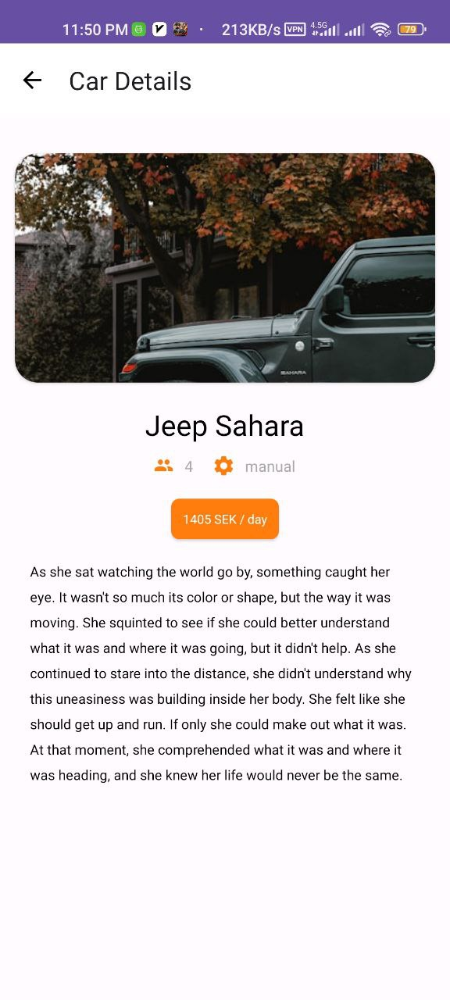
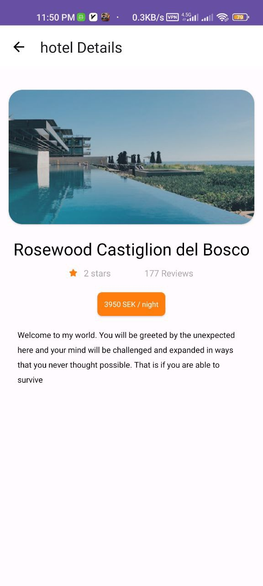

# Fast Travel
Fast Travel is an Android application developed in Kotlin that simplifies travel planning by providing a comprehensive platform for exploring and booking flights, tours, car rentals, and hotels. With a user-friendly interface and a range of features, this app aims to enhance the travel experience for users.

# Key Features
All-in-One Travel Platform: Access and book flights, tours, car rentals, and hotels within a single application.

Intuitive User Interface: Enjoy a seamless user experience with a well-designed and easy-to-navigate interface.

Flight Booking: Explore a variety of flight options, select preferred airlines, and book tickets conveniently.

Tour Packages: Discover exciting tour packages to diverse destinations, creating memorable travel experiences.

Car Rental Services: Choose from a selection of rental vehicles to suit your travel needs and preferences.

Hotel Reservations: Browse and book accommodations tailored to your requirements and budget.

Secure Payments: Make bookings confidently with secure and convenient payment options.

User Profile and History: Maintain a personalized profile, track your travel history, and manage your preferences.

## Installation

[Download APK](https://raw.githubusercontent.com/vakiliali79/Fast-Travel-Android/master/Fast-Travel.apk)

# How to Use
Clone the Repository:

bash

git clone https://github.com/vakiliali79/Fast-Travel-Android-App.git

Open in Android Studio:

Open the project in Android Studio to explore, build, and modify the application.

Customize and Build:

Tailor the app to your needs or make enhancements. Build the project using Android Studio.

Run on Emulator or Device:

Test the app by running it on an emulator or a physical Android device.

Contribute:

If you'd like to contribute to the project, feel free to open issues, submit pull requests, or provide feedback.

## Screenshots:

- **Screenshot 1**:

  

- **Screenshot 2**:

  

- **Screenshot 3**:

  

- **Screenshot 4**:

  

- **Screenshot 5**:

  

- **Screenshot 6**:

  

- **Screenshot 7**:

  

- **Screenshot 8**:

  

- **Screenshot 9**:

  

  
# Contact
For inquiries or feedback, please contact vakiliali79@gmail.com .

